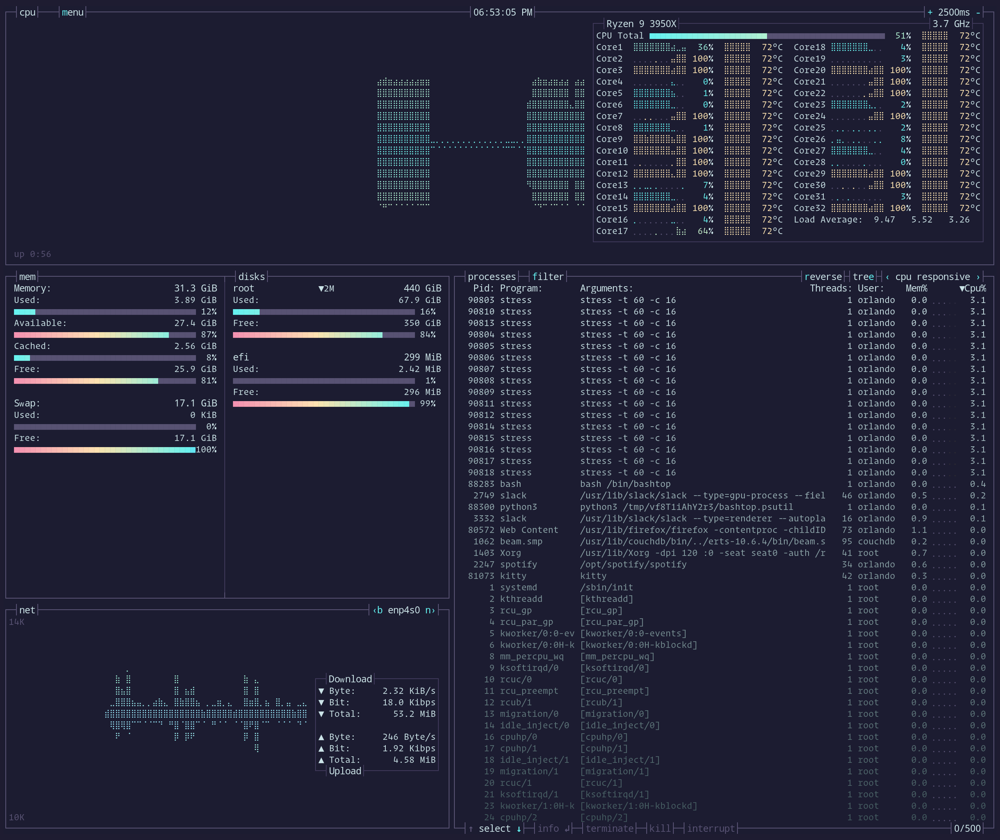

# Bashtop/Bpytop
An ambitious theme for bashtop/bpytop

 

## Installation

### Bashtop

Add `embark.theme` to the `$XDG_CONFIG/bashtop/user_themes` folder and select `embark` as your theme. For help with themes see the [docs](https://github.com/aristocratos/bashtop#themes) in the bashtop repo.

### Bpytop
Add `embark.theme` to the `$XDG_CONFIG/bpytop/themes` folder and select `embark` as your theme. For help with themes see the [docs](https://github.com/aristocratos/bpytop#themes) in the bpytop repo.

